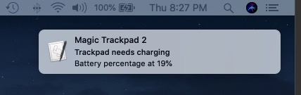

# magic-trackpad-charging-alert

This is a custom AppleScript I wrote to notify me when my Magic Trackpad needs charging. Apple's default alert only triggers when the trackpad's charge is below 5%, which is often not enough time before it dies completely.

The script will check if my trackpad's charge is below 10%, and if so trigger a notification. Here's an example alert that was fired when the critical threshold was 20%:

I've also created a .plist Launch Agent that will run this script every morning at 9 am. In order to replicate it, you have put such a .plist file in your /Library/LaunchAgents folder. Here is an article describing in more detail on [how to set up scheduled scripts in macOS](https://www.maketecheasier.com/use-launchd-run-scripts-on-schedule-macos/).
